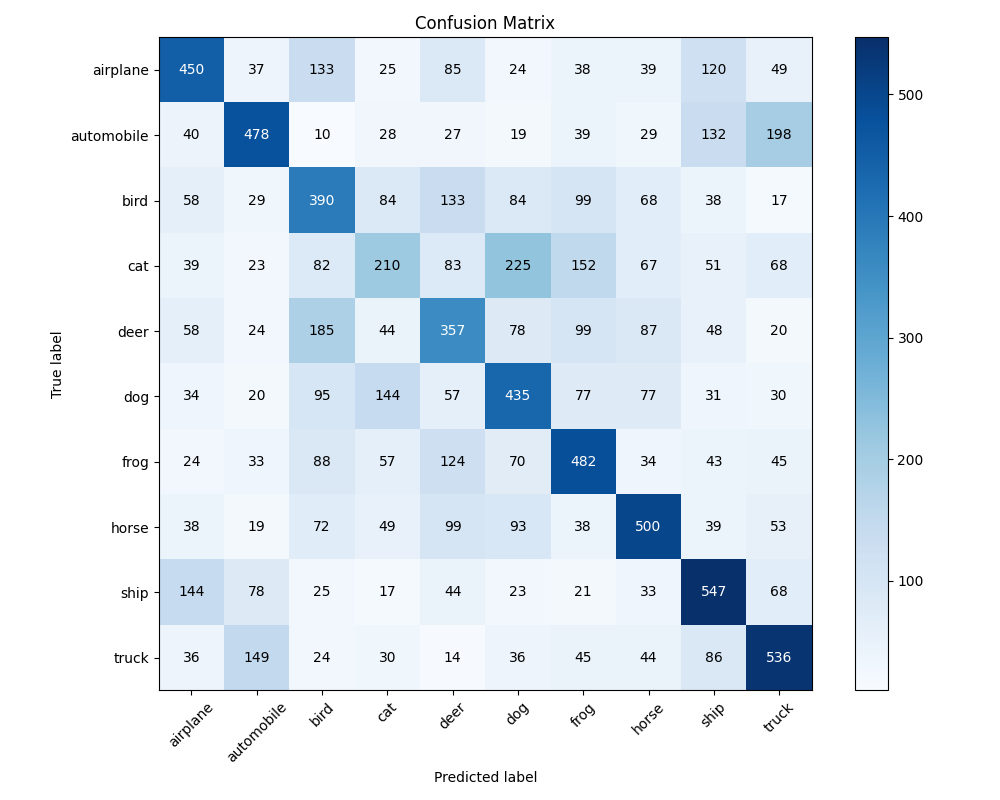

# Assignment 2: CIFAR-10 Image Classification

This assignment implements classification models for the CIFAR-10 dataset using scikit-learn. The implementation includes two classification approaches:

1. Logistic Regression classifier
2. Neural Network classifier (MLPClassifier)

## Quickstart

The simplest way to run the assignment is using the provided run.sh script:
```bash
./run.sh
```
Then select option 2 from the menu.

**Note:** Using the run.sh script will execute the assignment with default configurations only. For customized runs with different parameters, see the Configuration section below.
To run the assignment without run.sh, navigate to the src directory and execute:

```bash
cd src
uv run python -m assignment_2.main
```

#### Configuration

There are two ways to customize the configuration parameters:

1. **Edit config.py:** Modify the default configuration values directly in the `config.py` file.
2. **Use command line options:** Override specific settings using command line flags when running the script.

You can customize the run using command line options which will override the corresponding settings in `config.py`.
The main.py script accepts the following commands:

```
--model  Which model to run [logistic_regression, neural_network, both]
```

Example usage:
```bash
cd src
uv run python -m assignment_2.main --model neural_network
```

When the `--model` flag is provided, it overrides the `run_models` setting in the configuration. If not provided, the script uses the value from `config.py`.

## Project Structure

```
src/assignment_2/
├── README.md                          # This documentation file
├── main.py                            # Main script to run classifiers
├── config.py                          # Configuration class for all parameters
├── models/                            # Classification model implementations
│   ├── base_classifier.py             # Abstract base class for classifiers
│   ├── logistic_regression.py         
│   └── neural_network.py              
├── utils/                             # Assignment-specific utilities
│   ├── cifar_10.py                  
│   ├── image_utils.py                 
│   └── model_evaluation.py                
└── output/                            # Primary results and output files directory
        ...

```

Note: This project also has dependencies on the shared_lib module which provides common utilities and services for image processing, file handling, logging, model evaluation, and visualization.


## Architecture Overview

The implementation follows a modular architecture with the following components:

- **Data Processing**: Loading and preprocessing the CIFAR-10 dataset (conversion to grayscale, normalization)
- **Model Training**: Training both Logistic Regression and Neural Network classifiers
- **Evaluation**: Generating classification reports, confusion matrices, and performance metrics
- **Visualization**: Plotting loss curves (for Neural Network)
- **Configuration module**: Uses Pydantic models for flexible configuration

## Data


### Data Splitting

It's worth noting how the data splits are not identical when training each model:

1. **Initial Split**: The CIFAR-10 dataset comes pre-divided into 50,000 training images and 10,000 test images.

2. **Logistic Regression Classifier**:
   - Uses a simple two-way split
   - Training set: All 50,000 training images
   - Test set: 10,000 images (original test set)
   - No validation set is needed since there's no early stopping mechanism

3. **Neural Network Classifier** (with early stopping enabled):
   - Creates a three-way split of the data
   - Training set: 45,000 images (90% of original training data)
   - Validation set: 5,000 images (10% of original training data, controlled by validation_fraction parameter)
   - Test set: 10,000 images (original test set)
   - The validation set is created internally by scikit-learn's MLPClassifier and used to monitor performance for early stopping

### Data Preprocessing

1. Load the CIFAR-10 dataset using TensorFlow's keras.datasets
2. Convert images to grayscale (optional)
3. Normalize pixel values to [0, 1]
4. Flatten the images to be compatible with scikit-learn classifiers

## Model Overview

### Logistic Regression Classifier

The implementation uses scikit-learn's LogisticRegression with the following default parameters:
- Solver: saga (efficient for larger datasets)
- Maximum iterations: 1000
- Tolerance: 0.001
- Regularization parameter (C): 0.1

Note that in scikit-learn's LogisticRegression:
- `max_iter` refers to the maximum number of solver iterations for convergence (not epochs)
- The solver will stop earlier if the model converges (when the improvement in loss is less than `tol`)
- The actual number of iterations is typically lower than the maximum when convergence is reached (in our case, 121 iterations)

### Neural Network Classifier

The implementation uses scikit-learn's MLPClassifier with the following default parameters:
- Hidden layer sizes: (200, 100, 50)
- Activation: ReLU
- Solver: adam
- Alpha: 0.0001
- Learning rate: adaptive
- Batch size: 200
- Maximum iterations: 200
- Early stopping: True
- Validation fraction: 0.1 
- n_iter_no_change: 10
- Tolerance: 0.0001

Note that in scikit-learn's MLPClassifier:
- `max_iter` directly corresponds to the maximum number of epochs (complete passes through the training data)
- With `early_stopping` enabled, training may stop before reaching the maximum number of epochs
- Training stops after `n_iter_no_change` consecutive epochs without improvement on the validation set
- The actual number of epochs conducted is typically lower than the maximum (as shown in the Results Analysis section, the model stopped after 50 epochs due to early stopping)


## Output

The classifiers generate the following outputs in the specified output directory:

1. **Classification Report**: Precision, recall, and F1-score for each class
2. **Confusion Matrix**: Visual representation of prediction accuracy
3. **Loss Curve**: Training loss over iterations (Neural Network only)
4. **Model Information**: Model parameters and training details

## Notes on Performance
- The Logistic Regression classifier provides a baseline performance but is limited in capturing complex patterns in image data.
- The Neural Network classifier generally achieves higher accuracy but requires more computational resources.
- Converting to grayscale reduces dimensionality (and training time) but impacts accuracy for color-sensitive classes.

## Results Analysis

The experiments on the CIFAR-10 dataset shows significant performance differences between the two classification approaches. Analysis of both models demonstrates clear strengths and weaknesses when classifying different object categories.  Object categories with distinct structural features (vehicles) were consistently better classified across both models, while classes with variable appearances and postures (animals) presented greater challenges.

### Logistic Regression Classifier
- Achieved an overall accuracy of 29.59% on the test set, establishing a baseline performance
- Best performance on vehicle classes: trucks (40.28% F1-score) and automobiles (36.84% F1-score)
- Struggled significantly with animal classes, particularly cats (18.64% F1-score) and deer (20.83% F1-score)
- Converged after 121 iterations with the saga solver, well before the maximum 1000 iterations limit
- Training completed efficiently due to the relatively simple model architecture


*Figure 1: Confusion matrix for the Logistic Regression classifier showing classification performance across the 10 CIFAR-10 classes. Diagonal elements represent correct classifications, while off-diagonal elements show misclassifications.*

### Neural Network Classifier
- Demonstrated substantially better performance with an overall accuracy of 43.85% (14.26% improvement over logistic regression)
- Strongest classification performance on vehicles: trucks (51.44% F1-score), ships (51.24% F1-score), and automobiles (50.58% F1-score)
- Despite improved performance overall, still struggled with cat classification (24.88% F1-score)
- Early stopping triggered after 50 epochs (of maximum 200), indicating efficient convergence, though the loss curve suggests potential for further improvement


*Figure 2: Confusion matrix for the Neural Network classifier. Note the improved diagonal values compared to Logistic Regression, indicating better classification performance across most classes.*


*Figure 3: Loss curve showing the neural network's training progression over 50 epochs. The decreasing trend shows continuous improvement without plateauing, suggesting early stopping may have been triggered prematurely despite the model's potential for further optimization. However, the early stopping was triggered due to the accuracy on the validation data not increasing meaningfully over 10 epochs.*

## Limitations

Several important limitations affected the performance and scope of this classification work:

### Data Preprocessing Limitations
- Converting images to grayscale significantly reduces the information available to the models, particularly affecting classes distinguished by color (e.g., birds)
- No data augmentation was implemented, limiting the models' ability to generalize across different object orientations and scales

### Model Architecture Limitations
- The logistic regression model assumes linear separability between classes, which is unrealistic for complex image data
- The MLPClassifier implementation in scikit-learn lacks modern deep learning techniques like convolutions, which are specifically designed for image data
- Both models are very simple compared to state-of-the-art computer vision approaches, explaining the relatively low accuracy.

### Computational Constraints
- Using scikit-learn's MLPClassifier without GPU acceleration limits the feasible model size and training time
- The neural network parameters were constrained by computation time considerations rather than optimal performance
- Hyperparameter tuning was limited, with only a single configuration tested for each model type

### Evaluation Limitations
- The evaluation metrics focus on classification accuracy without considering confidence scores or error analysis
- No cross-validation was performed
- No analysis of misclassified examples was conducted to identify potential improvements

## References

- CIFAR-10 dataset: https://www.cs.toronto.edu/~kriz/cifar.html
- scikit-learn documentation: https://scikit-learn.org/stable/
- Pydantic documentation: https://docs.pydantic.dev/