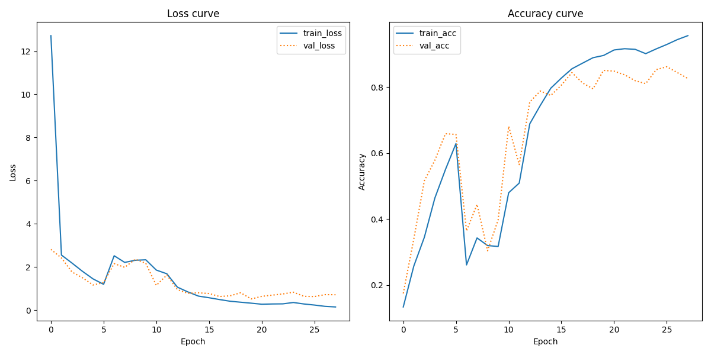

# Assignment 3: Transfer Learning with Pretrained CNNs

## Overview

This assignment implements two approaches for classifying Lego brick images:

1. A custom CNN trained directly on the image data
2. A transfer learning approach using a pre-trained VGG16

The goal is to compare these two approaches and determine whether transfer learning improves performance for this specific image classification task.

## Dataset

- The dataset consists of images of various Lego bricks arranged in folders named after the brick type. 
- We use only the data from the `data/lego/cropped` folder, which contains images with backgrounds removed 
- The data should be placed in the `data/lego/cropped/*` directory. 


## Quickstart

The simplest way to run the assignment is using the provided run.sh script:

```bash
./run.sh
```
Then select option 3 from the menu.

You can also run the code without run.sh:
```bash
# Navigate to src from the project root
cd src

# Run as module
uv run python -m assignment_3.main 
```

## Configuration

The project uses a central configuration system in `config.py` that can be modified to customize various aspects:

- Data Configuration: Control image dimensions and data directory paths settings
- CNN Model Configuration: Adjust architecture parameters, learning rates, and training settings
- VGG16 Model Configuration: Configure transfer learning parameters, fine-tuning depth, and training settings
- Output Configuration: Set output directory paths for saving models, reports, and visualizations

All settings are managed through Pydantic classes, making it easy to modify behavior without changing code.

#### Command Line Arguments
- `--data-dir`: Path to the Lego data directory (must exist and be a directory)
- `--output-dir`: Path to save the output (default: ./src/assignment_3/output)
- `--cnn-only`: Train only the CNN model
- `--vgg16-only`: Train only the VGG16 model

## Project Structure

```
src/assignment_3/
├── config.py                    # Configuration settings
├── main.py                      # Main entry point
├── assignment_description.md    # Assignment description
├── README.md                    # Project documentation
├── session9_inclass_rdkm.ipynb  # In-class notebook reference
├── data/                        # Data modules
│   └── data_loader.py           # Data loader
├── models/                      # Service modules
│   ├── base_classifier_model.py # Base model class
│   ├── cnn_model.py             # Direct CNN classifier
│   └── vgg16_transfer_learning_model.py  # VGG16-based classifier
├── utils/                       # Utility functions
│   └── model_comparison.py      # Model comparison utilities
└── output/                      # Output directory
    ├── cnn/                     # Output for CNN model
    │   ├── classification_report.txt
    │   ├── learning_curves.png
    │   └── training_history.json
    ├── vgg16/                   # Output for VGG16 model
        ├── classification_report.txt
        ├── learning_curves.png
        └── training_history.json
```

## Implementation Details

### Data Processing
- Images are resized to 224×224 pixels with 3 color channels
- Batches of 32 images are processed at a time
- Data is split with 80/10/10 % train, test and validation.
- We experimented with various data augmentation techniques (rotation, zoom, flip, shift) but found that models achieved better validation results without augmentation. The final implementation therefore uses the original images without augmentation.

### CNN Model Architecture
The custom CNN is configured with the following architecture:
- Input shape: (224, 224, 3)
- Convolutional layers with increasing filter complexity: [32, 64, 128]
- 3×3 kernel sizes with 2×2 max pooling
- Two dense layers [512, 256] with ReLU activation
- Dropout (0.5) for regularization
- Softmax output layer for classification
- Adam optimizer with learning rate 0.001
- Early stopping with patience=8 to prevent overfitting
- Trained for up to 30 epochs (may stop earlier with early stopping)

### VGG16 Transfer Learning Model
- We're using VGG16 (pretrained on ImageNet) as our foundation
- We've removed the top classification layers (include_top=False)
- We're fine-tuning the last 4 convolutional layers 
- We're applying global average pooling to simplify feature maps
- The classifier contains:
  - Two dense layers (256→128 units)
  - BatchNormalization to stabilize training
  - Dropout (0.5) to prevent overfitting
  - Standard softmax output for classification
- We use SGD with momentum (0.9) and a lower learning rate (0.0005)
- Early stopping with patience=8 to prevent overfitting
- We are training for up to 30 epochs (may stop earlier with early stopping)

#### Transfer Learning Strategy

Our implementation freezes earlier VGG16 layers while making only the final 4 convolutional layers trainable. This approach makes use of the hierarchical nature of convolutional networks, where initial layers capture universal visual primitives (edges, textures, basic shapes) that generalize well across domains, while deeper layers represent increasingly task-specific features. 

First, it addresses the potential for overfitting given our relatively constrained dataset size. By limiting the number of trainable parameters, we create a more favorable ratio between trainable weights and available training examples.

Second, this approach significantly reduces computational requirements compared to full fine-tuning.

Third, the method creates an balance between knowledge transfer and domain adaptation. By preserving the robust feature extractors from VGG16's early layers (trained on millions of ImageNet images) while allowing later layers to adapt to Lego-specific characteristics,

Finally, selective freezing provides gradient stability benefits during training. By reducing the network's effective depth from the perspective of backpropagation, we mitigate vanishing gradient issues and prevent catastrophic forgetting of useful pre-trained features.

The transfer learning configuration is parameterized through the `trainable_layers` setting, allowing experimentation with freezing strategies based on dataset characteristics and target domain similarity to the ImageNet source distribution.

### Evaluation Methodology

Our evaluation framework implements a three-way data partitioning, allocating 80% of available data for model training, 10% for validation-based early stopping decision, and 10% for unbiased final performance assessment. This approach prevents potential data leakage between model selection and evaluation phases, giving a more realistic estimate of model performance.

Performance quantification incorporates both primary metrics (accuracy) and secondary distributional metrics (precision, recall, F1-score) to provide insight into classification behavior across all class categories. Temporal learning dynamics are visualized through epoch-wise training and validation metrics, enabling identification of potential optimization issues including underfitting, overfitting, and convergence patterns.

## Results

Our experiments comparing custom CNN and transfer learning approaches for Lego brick classification showed benefits of pre-trained models.

### Performance Comparison

The custom CNN achieved 84.40% test accuracy after 28 epochs, with training and validation accuracies of 95.58% and 86.16% respectively. Despite early stopping, the growing gap between training and validation metrics indicated the model was beginning to overfit.

The VGG16 transfer learning approach substantially outperformed the custom CNN with 96.58% test accuracy - a 12 percentage point improvement. The VGG16 model demonstrated rapid learning (reaching >93% validation accuracy by epoch 8) and exceptional generalization, with validation (97.10%) and test (96.58%) accuracies actually exceeding training accuracy (93.40%).

This performance difference shows transfer learning's effectiveness in classification tasks. The model efficiently adapted general visual pattern recognition to Lego-specific characteristics.

### Learning Comparison

The custom CNN showed a somewhat uneven learning curve with fluctuations in validation metrics, though with an overall positive trajectory. The training accuracy steadily increased to 95.58% by the final epoch, while validation accuracy peaked at 86.16% in epoch 25 before declining slightly, triggering early stopping. This growing gap between training and validation metrics indicates the model was beginning to overfit to the training data.


*Figure 1: Training and validation loss/accuracy curves for the custom CNN model*

The VGG16 model exhibited better learning with some fluctuations in validation accuracy but an overall stronger trajectory. By epoch 8, it had already achieved validation accuracy above 93%. The final validation accuracy of 97.10% actually exceeds the training accuracy of 93.40%, and this pattern continues with the test accuracy of 96.58% - a sign of excellent generalization across all three data splits.


*Figure 2: Training and validation loss/accuracy curves for the VGG16 transfer learning model*

The big difference in performance between the two models shows why transfer learning works so well for specific image tasks like this one. By using VGG16's pre-trained weights from ImageNet, our model started with ready-made feature detectors that could seemingly already spot patterns in Lego bricks - things like edges, colors, textures, and shapes. By fine-tuning just the last 4 convolutional layers, we let the model adapt these general features to the specific characteristics of Lego bricks.

The jaggedness visible in both models' validation curves (particularly pronounced in the CNN model) is likely due to the relatively small validation set. These fluctuations are a common challenge in ML practice and directly influenced the training setup - specifically, the early stopping patience was increased from 5 to 8 epochs to prevent prematurely halting training during these unstable periods. This adjustment allowed both models to reach more stable performance in later epochs, providing more reliable results for our comparison.

### Limitations

We did not perform hyperparameter optimization for either model, instead using fixed configurations. We implemented early stopping with a patience of 8 epochs to prevent overfitting. Additionally, we limited our exploration to two specific architectures.

Although our initial experiments with data augmentation showed better validation results without augmentation, further experimentation with different augmentation strategies (such as more targeted transformations specific to the Lego domain) might further improve results. Similarly, more extensive fine-tuning of the VGG16 layers might yield even better performance. These limitations present opportunities for future work to further improve performance on the Lego classification task.