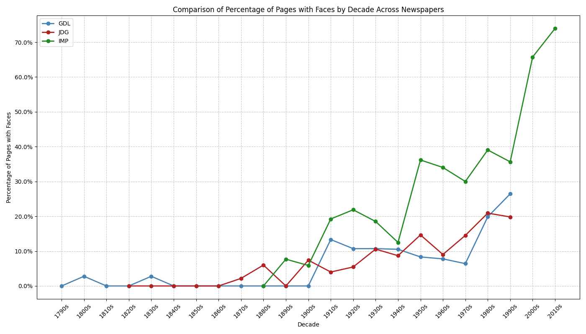

# Assignment 4: Detecting Faces in Historical Newspapers

## Overview

This project analyzes the presence of human faces in historical Swiss newspapers over time. Specifically, we examine three historic Swiss newspapers:

- The Journal de Genève (JDG, 1826-1994)
- The Gazette de Lausanne (GDL, 1804-1991)
- The Impartial (IMP, 1881-2017)

The analysis uses a pre-trained CNN model (MTCNN) to detect faces in newspaper page images, groups the results by decade, and visualizes trends in the prevalence of human faces in print media over approximately 200 years.

## Project Structure

```
assignment_4/
├── config.py                  # Configuration settings 
├── main.py                    # Main script to run the analysis
├── services/                  # Service modules
│   ├── data_service.py        # Data loading and processing
│   └── face_detection_service.py  # Face detection with MTCNN
├── utils/                     # Utility modules
│   └── visualization.py       # Visualization utilities
└── output/                    # Output directory
    ├── results/               # CSV results
    └── plots/                 # Visualization plots
```

## Getting Started

Clone the repository and install the required packages:

```bash
# Clone the repository
git clone <repository-url>
cd <repository-directory>

# Install dependencies
uv sync
```

## Usage

Run the main script to process the newspaper images and generate the analysis:

```bash
# Process all newspapers
uv run -m src.assignment_4.main

# Process only a specific newspaper
uv run -m src.assignment_4.main --newspaper GDL

# Specify custom data and output directories
uv run -m src.assignment_4.main --data-dir /path/to/data --output-dir /path/to/output
```

### Command Line Options

- `--data-dir`: Path to the newspaper images directory (must exist and be a directory)
- `--output-dir`: Path to save the output
- `--newspaper`: Process only a specific newspaper (choices: GDL, JDG, IMP)

## Data

This project uses the Swiss newspapers corpus from [this Zenodo dataset](https://zenodo.org/records/3706863). The dataset contains:

- 1008 newspaper pages from the Gazette de Lausanne (1790s-1990s)
- 1982 newspaper pages from the Journal de Genève (1820s-1990s)
- 1634 newspaper pages from the Impartial (1880s-2010s)

The images are located at `data/newspapers/images/` and organized into three folders (GDL, JDG, IMP) corresponding to each newspaper.

## Methodology

The analysis follows these steps:

1. **Data Loading**: Load newspaper images from the dataset.
2. **Year Extraction**: Extract the year of publication from each filename.
3. **Face Detection**: Use MTCNN to detect faces in each newspaper page.
4. **Decade Aggregation**: Group results by decade to analyze temporal trends.
5. **Visualization**: Create plots showing the percentage of pages with faces over time.

## Results

The analysis produces the following outputs:

1. **CSV Files**:
   - Individual CSV files for each newspaper showing face count and percentage by decade
   - A combined CSV with results from all newspapers
   - Summary statistics

2. **Visualizations**:
   - Individual plots for each newspaper showing percentage of pages with faces by decade
   - A comparison plot showing trends across all newspapers

The outputs are saved to the `output/` directory.

## Interpretation

The results of this analysis demonstrate how the presence of human faces in printed media has evolved over time. These changes likely reflect:

1. **Technological Evolution**: The development of photography and printing technology
2. **Cultural Shifts**: Changes in journalistic practices and media presentation
3. **Social Factors**: The increasing personalization of news and media content

A detailed interpretation of the results is provided in the analysis section below.

## Analysis

After running our face detection analysis on the three Swiss newspapers, we've see some trends in how human faces have been represented in print media over the past two centuries.

### Overall Trends

The most obvious observation is the dramatic increase in the percentage of newspaper pages containing faces over time. Newspapers go from rarely showing human faces to publications where faces appear on the majority of pages in more recent decades.

Looking at the total face counts reveals an even more dramatic difference between the newspapers: IMP has significantly more total faces detected (2,562) than GDL (280) and JDG (577) combined. This suggests not just more pages with faces in IMP, but also more faces per page on average.



As shown in the comparison visualization above, IMP consistently featured significantly more faces than the other newspapers throughout most of its publication history. Meanwhile, GDL and JDG followed similar trajectories, with both ending up at almost identical overall percentages (GDL at 20.5% and JDG at 20.1%).

### Individual Newspaper Patterns


#### The Impartial (IMP, 1881-2017)

IMP stands out dramatically from the other publications:
- Very early on, from 1890s, faces appeared on +20% of pages, jumping up from 2% in 1880's.
- By the 1920s, faces appeared on 45% of pages - more than double what we see in the other papers, and then slows down over the next two decades.
- The 1950s it reaches 50%
- The most recent periods show an extraordinary prevalence, reaching over 70% in the 2000s and nearly 80% by the 2010s

Interestingly, IMP shows a noticeable temporary decline in the 1930s-1940s (dropping from 45% to around 28%), which might be related to World War II and its impact on newspaper production and content.

The 77.66% figure for IMP in the 2010s represents an extraordinary shift in visual journalism, with more than three-quarters of all pages containing human faces.

This suggests a publication that embraced visual journalism from an earlier period and continued to increase its visual focus throughout its history. This is in contrast to GDL and JDG, described below, that seemingly adopted this more slowly.

#### The Gazette de Lausanne (GDL, 1804-1991)

GDL shows the following trend:
- In its earliest period (1790s-1850s), faces appeared on only 0-15% of pages
- There's a noticeable uptick in the early 1900s
- From the 1920s through the 1960s, the percentage stabilizes around 20%
- The most dramatic shift occurs in the 1980s-1990s, with percentages jumping to 32-35%

GDL actually shows an interesting early peak in the 1800s (25%) that then declined significantly before rising again in the 20th century - the reason for this is not obvious.
´

#### The Journal de Genève (JDG, 1826-1994)

JDG shows a more gradual but steady progression:
- The 19th century shows minimal face presence (0-10%)
- A notable increase appears in the early 20th century
- The 1950s there's face on 25% of pages
- Like GDL, JDG reaches an all time high in 1980's-1990's

JDG shows more variability between decades compared to the other newspapers, with more noticeable up and down movements rather than a steady increase.

### Historical Context and Significance

These patterns reflect several important developments:

1. **Technological Evolution**: The introduction of photography and improvements in printing technology made it increasingly feasible and affordable to include images in newspapers.

2. **Cultural Transformation**: The increasing prevalence of faces reflects a fundamental shift in how news was presented - from dense text focused on events and facts toward more human-centered storytelling that emphasized individuals.

3. **Regional Differences**: The significant difference between IMP and the other two newspapers might reflect different editorial philosophies or regional preferences. IMP seems to have embraced a more visual, personalized style of reporting much earlier than its counterparts.

4. **Modern Visual Culture**: The dramatic increase in the most recent decades (particularly for IMP) mirrors broader cultural shifts toward visual media and personality-focused journalism.

It's worth noting that our dataset shows an uneven distribution of pages across decades, with more pages available from recent decades. For example, JDG has 424 pages from the 1990s but only 26 from the 1820s. While this reflects the changing volume of newspaper production over time, it may also influence the reliability of our decade-by-decade comparisons.

This analysis provides a quantitative glimpse into the visual transformation of print media, showing how newspapers evolved from text-heavy documents to increasingly visual platforms that prominently feature human faces. The trend accelerated dramatically in the late 20th and early 21st centuries, suggesting a fundamental shift in how information is communicated and consumed.

## Limitations

This analysis has several limitations to consider:

1. **Image Quality**: Historical newspaper scans vary in quality, which may affect face detection accuracy.
2. **Historical Context**: Changes in newspaper formats, layouts, and content focus over time might influence the results.
3. **Temporal Distribution**: While we have a substantial number of pages from each newspaper, the distribution across different time periods may not be even, potentially affecting decade-to-decade comparisons.


## Requirements

This project requires the following Python packages:

- torch
- facenet-pytorch
- PIL
- pandas
- matplotlib
- numpy
- pydantic-settings
- click

## Credits

This project was created as part of the Cultural Data Science - Visual Analytics course at Aarhus University.

- Dataset: Swiss newspapers corpus from [Zenodo](https://zenodo.org/records/3706863)
- Face detection: [FaceNet-PyTorch](https://github.com/timesler/facenet-pytorch) implementation of MTCNN


